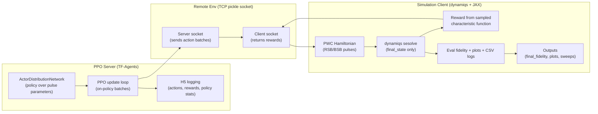

# Trapped-Ion RL Control (dynamiqs + PPO server–client)

This repository implements **model-free, measurement-style reinforcement learning** for
**trapped-ion spin–motion quantum control**. A TF-Agents PPO server proposes piecewise-
constant red/blue sideband pulse parameters, and a dynamiqs + JAX simulation client
executes the dynamics and returns measurement-style rewards computed from sampled
phase-space characteristic-function values (with optional Wigner/parity fallbacks).

Primary pipelines:
- `examples/trapped_ion_cat/` — cat-state preparation
- `examples/trapped_ion_gkp/` — GKP state preparation (paper-aligned pipeline)
- `examples/trapped_ion_binomial/` — binomial code state preparation, including
  **quasi-static dephasing-robust training**

Additional small examples:
- `examples/pi_pulse/`, `examples/pi_pulse_oct_style/` (QuTiP-based)

## Architecture (server–client)



## Environments

Two stacks are used in practice:
- **PPO server**: TensorFlow + TF-Agents
- **Simulation client**: dynamiqs + JAX

You can run with a single Python environment (CPU) or split server/client into
separate envs (recommended on clusters). Gadi helper scripts are in `gadi/`.

### Option A: Gadi setup (recommended on HPC)

Follow `gadi/README_GADI.md` and use `gadi/setup_envs.sh` to create two venvs:
- `venv_tf` (TF/TF-Agents server)
- `venv_dq` (dynamiqs/JAX client)

Then run an example with:
```bash
SERVER_PYTHON=/path/to/venv_tf/bin/python \
CLIENT_PYTHON=/path/to/venv_dq/bin/python \
POST_PYTHON=/path/to/venv_dq/bin/python \
bash run_with_logs.sh
```

### Option B: Local single-env (CPU)

```bash
pip install -r requirements.txt
pip install -e .
```

If you want GPU JAX locally, install JAX with the CUDA wheel per the JAX
instructions and override the `jax/jaxlib` entries in `requirements.txt`.

## Quick runs

Cat state:
```bash
cd examples/trapped_ion_cat
bash run_with_logs.sh
```

GKP:
```bash
cd examples/trapped_ion_gkp
bash run_with_logs.sh
```

Binomial:
```bash
cd examples/trapped_ion_binomial
bash run_with_logs.sh
```

Each `run_with_logs.sh` launches server + client, writes `*.h5` logs, then
parses plots and metrics into `outputs/`.

## Dephasing-robust training (binomial)

The binomial pipeline supports **quasi-static detuning robustness**:
- `H_total = H_rsb/bsb + delta * n_hat`
- `delta ~ Uniform[-0.05 * Omega, +0.05 * Omega]`

Key environment variables (see `examples/trapped_ion_binomial/README.md` for full list):
- `ROBUST_TRAINING=1`
- `DEPHASE_MODEL=quasi_static`
- `DEPHASE_DETUNING_FRAC=0.05`
- `DEPHASE_NOISE_SAMPLES_TRAIN`, `DEPHASE_NOISE_SAMPLES_EVAL`,
  `DEPHASE_NOISE_SAMPLES_REFINE`
- `ROBUST_NOMINAL_FID_FLOOR`, `ROBUST_FLOOR_PENALTY`
- `ROBUST_COMPARE_BASELINE_NPZ` (generate robust-vs-baseline sweep)

Outputs in robust mode:
- `outputs/dephasing_sweep_robust.csv/png`
- `outputs/dephasing_compare.csv/png` (when a baseline pulse is provided)
- `eval_robust_metrics.csv` + `final_robust_score.txt`

## Outputs & logs

- H5 logs from the PPO server: `examples/*/*.h5`
- Eval curves: `examples/*/eval_fidelity.csv`
- Final plots/metrics: `examples/*/outputs/`
- PBS logs on Gadi: `logs/`

## Code map

Core server (`quantum_control_rl_server/`):
- `PPO.py`: PPO loop (TF-Agents)
- `dynamic_episode_driver_sim_env.py`: TF-Agents driver wrapper
- `tf_env.py`: TF-Agents environment (remote client)
- `tf_env_wrappers.py`: action scaling and wrappers
- `remote_env_tools.py`: socket utilities
- `h5log.py`: H5 logging

Main examples:
- `examples/trapped_ion_cat/` (dynamiqs + characteristic/Wigner rewards)
- `examples/trapped_ion_gkp/` (paper-aligned GKP pipeline)
- `examples/trapped_ion_binomial/` (binomial + dephasing-robust training)
- `examples/pi_pulse/`, `examples/pi_pulse_oct_style/` (QuTiP-based)

## References

Reference PDFs are stored at repo root for convenience:
- `Matsos et al. - 2024 - Robust and Deterministic Preparation of Bosonic Lo_副本.pdf`
- `PhysRevX.12.011059_副本.pdf`
- `悉尼大学 2_副本.pdf`
- `文字记录：悉尼大学 2025年11月14日.pdf`

## License

See `LICENSE`.
